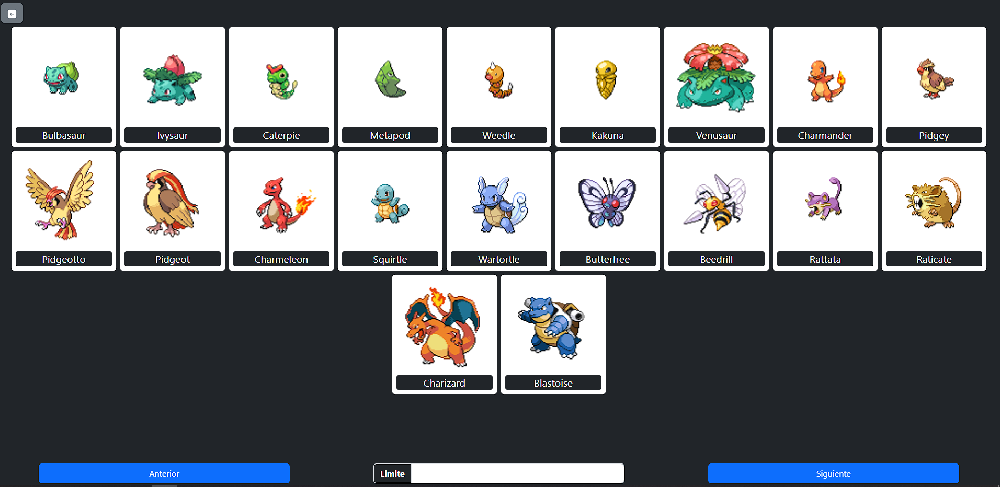
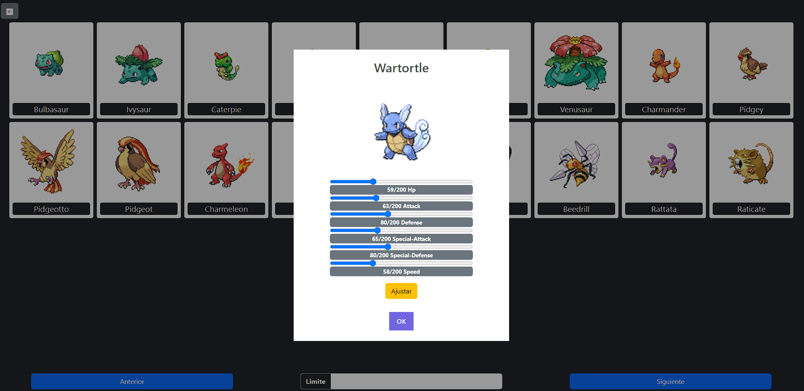

## Autor
- [Jaider Steeven Mendoza Cardona](https://github.com/Dabrox02)

# Proyecto PokeAPI
Este proyecto consiste en la integración de las tecnologias aprendidas HTML, CSS y JavaScript, con el fin de consumir las API's de [PokeAPI](https://pokeapi.co/) y [MockAPI](https://mockapi.io/).

## Tecnologias
Para la concepción del proyecto se hizo uso de las siguientes tecnologias, las cuales se integraron para crear el proyecto:

- HTML (HyperText Markup Language)
- SCSS (Syntactically Awesome Style Sheets)
- Bootstrap
- JavaScript
- [PokeAPI](https://pokeapi.co/)
- [MockApi](https://mockapi.io/)

## Requisitos Minimos
Para garantizar una implementación exitosa de la aplicación web:

- Acceso a Internet
- Dispositivo Compatible
- Navegador Compatible:
  - [Mozilla Firefox](https://www.mozilla.org/es-ES/firefox/new/)
  - [Google Chrome](https://www.google.com/chrome/)

## Resultado
<a href="https://dabrox02.github.io/proyecto-pokeapi/" target="_blank">
    Click Aqui para Ver
    
    
</a>
