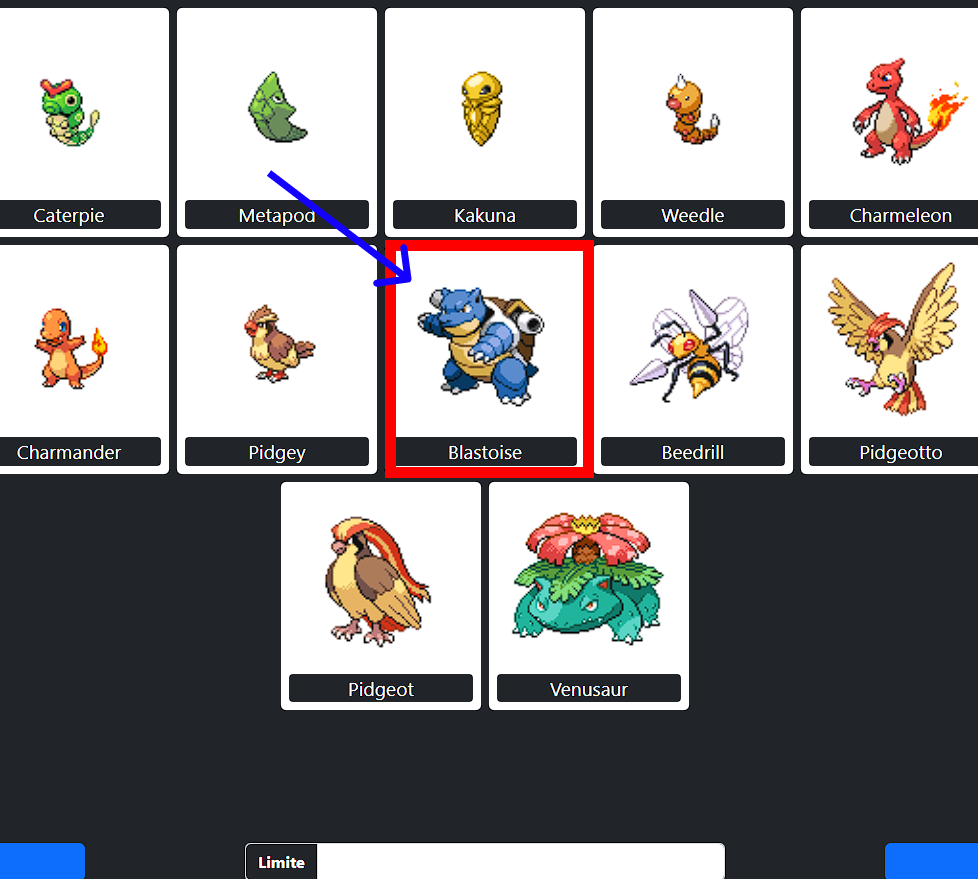
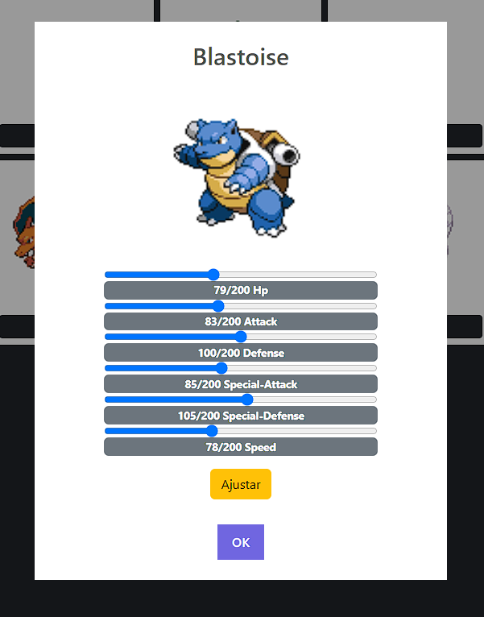
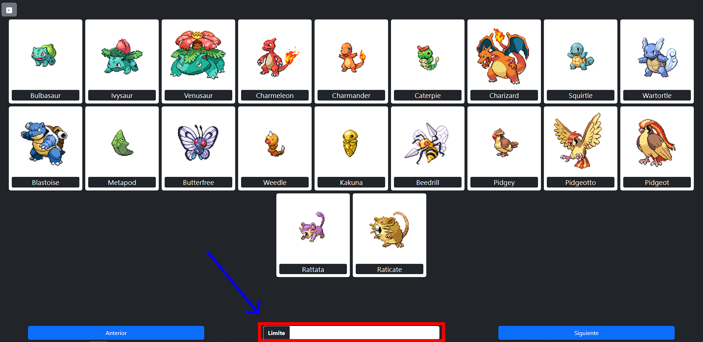
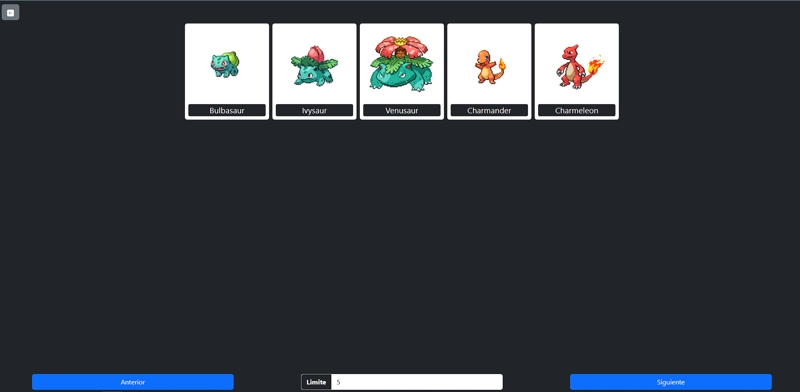
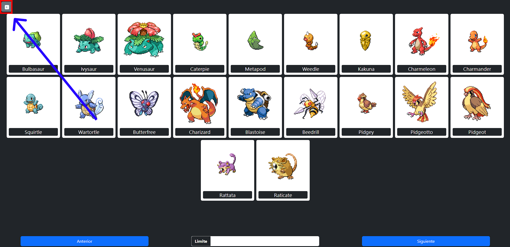
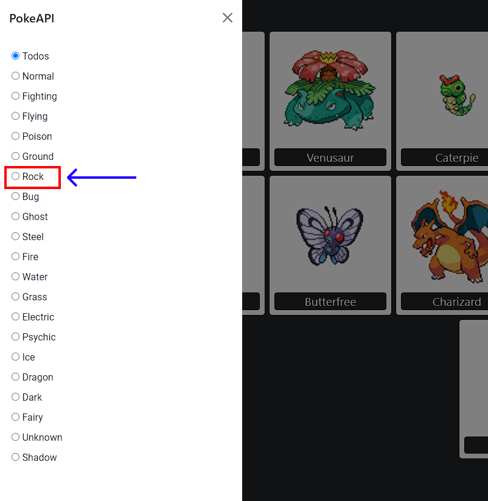
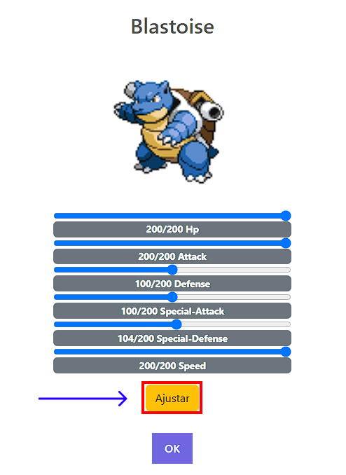

## Autor
- [Jaider Steeven Mendoza Cardona](https://github.com/Dabrox02)

# Proyecto PokeAPI
Este proyecto consiste en la integración de las tecnologias aprendidas HTML, CSS y JavaScript, con el fin de consumir las API's de [PokeAPI](https://pokeapi.co/) y [MockAPI](https://mockapi.io/).

## Tecnologias
Para la concepción del proyecto se hizo uso de las siguientes tecnologias, las cuales se integraron para crear el proyecto:

- HTML (HyperText Markup Language)
- SCSS (Syntactically Awesome Style Sheets)
- Bootstrap
- JavaScript
- [PokeAPI](https://pokeapi.co/)
- [MockApi](https://mockapi.io/)

## Requisitos Minimos
Para garantizar una implementación exitosa de la aplicación web:

- Acceso a Internet
- Dispositivo Compatible
- Navegador Compatible:
  - [Mozilla Firefox](https://www.mozilla.org/es-ES/firefox/new/)
  - [Google Chrome](https://www.google.com/chrome/)

## Implementación
### Interacción con la PokeAPI
Esta es una API de solo consumo. No se requiere autenticación para acceder a esta API y todos los recursos están completamente abiertos y disponibles. 

**API URI:** `https://pokeapi.co/api/v2/`

Para acceder a los datos de la API se uso el **endpoint** `pokemon`.

**URL:** `https://pokeapi.co/api/v2/pokemon`

***
### Interaccion con la MockAPI
MockAPI es una aplicación web que permite la creación de API REST simuladas mediante un sencillo modelado de datos y la generacion de datos falsos personalizados.

***
### Esquema de los datos
| Campo   | Tipo      |
| ------- | --------- |
| id      | Object ID |
| name    | STRING    |
| stats   | ARRAY     |
| sprites | OBJECT    |

***
**API URI:** `https://6511bf0bb8c6ce52b394fc11.mockapi.io/`

Para acceder a los datos almacenados se hace uso del **endpoint** `pokemons`.

**URL:** `https://6511bf0bb8c6ce52b394fc11.mockapi.io/pokemons`
***

## Uso de la Aplicación
Esta aplicación web permite explorar tarjetas de Pokémon con sus imágenes y nombres. Puedes hacer clic en cada una de las tarjetas para ver detalles más completos del Pokémon, además, puedes guardar estadísticas personalizadas de un Pokémon y filtrar Pokémon por tipo.

***

### Ver las estadisticas de un Pokemon
Para ver las estadisticas del pokemon que desees, seleccionalo y da **CLIC** en el.

  <h3>Paso 1</h3>
  
  <h3>Paso 2</h3>
  

***

### Limitar Cantidad de Pokemones para ver
Para cambiar la cantidad de pokemones en la parrilla, ubicate en la parte inferior central de la pantalla y selecciona el campo **LIMITE**, digita la cantidad de pokemones que deseas ver entre 1 a 999.

  <h3>Paso 1</h3>
  
  <h3>Paso 2</h3>
    

***

### Filtrar por tipo de Pokemon
Para filtrar por tipo, da **CLIC** en el botón de la parte superior izquierda y selecciona el tipo de pokemon que deseas ver.

  <h3>Paso 1</h3>
  
  <h3>Paso 2</h3>
    

***

### Cambiar Estadisticas Pokemon
Para cambiar las estadisticas del pokemon que desees, seleccionalo y da **CLIC** en el, luego modifica sus valores y dale en **AJUSTAR**.

  <h3>Paso 1</h3>
  
  <h3>Paso 2</h3>
    

***

## Resultado

  <a href="https://dabrox02.github.io/proyecto-pokeapi/" target="_blank">
      Click Aqui para Ver
      
  </a>

